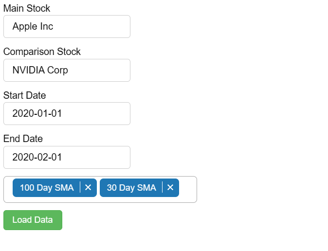

---

# Financial Dashboard with Bokeh and yfinance

## Description

This project is a simple financial dashboard built using Python and Bokeh for visualizing stock market data. It allows users to compare two stocks over a specified date range and visualize technical indicators such as Simple Moving Averages (SMA). The dashboard supports dynamic interaction with widgets for selecting stock symbols, date ranges, and indicators.

---

### Features:
- Fetch and visualize historical stock data.
- Plot technical indicators: 30-day and 100-day Simple Moving Averages (SMA).
- Interactive dashboard with dynamic date ranges and stock comparisons.
- Supports side-by-side comparison of two stocks.

---

### Technologies Used:
- **Python**: Programming Language
- **Bokeh**: Interactive Data Visualization
- **yfinance**: Stock Data API
- **numpy**: Numerical computations

---

### Getting Started

#### Prerequisites
- Python 3.x
- Required Python libraries:  
  Install them using:

  ```bash
  pip install -r requirements.txt
  ```

#### Installation
1. Clone the repository:

   ```bash
   git clone https://github.com/kirtanmakwana/Financial-Dashboard.git
   ```

2. Navigate to the project directory:

   ```bash
   cd Financial-Dashboard
   ```

3. Install dependencies:

   ```bash
   pip install -r requirements.txt
   ```

---

### Usage

1. Run the script:

   ```bash
   python main.py
   ```

2. A web-based dashboard will be displayed in your browser.
   


4. Use the widgets to input stock symbols, date ranges, and select indicators.

---

### Contributing

Contributions are welcome! Please fork this repository and create a pull request for any improvements or features you’d like to add.

---

### License

This project is licensed under the MIT License. See the [LICENSE](LICENSE) file for more details.

---
